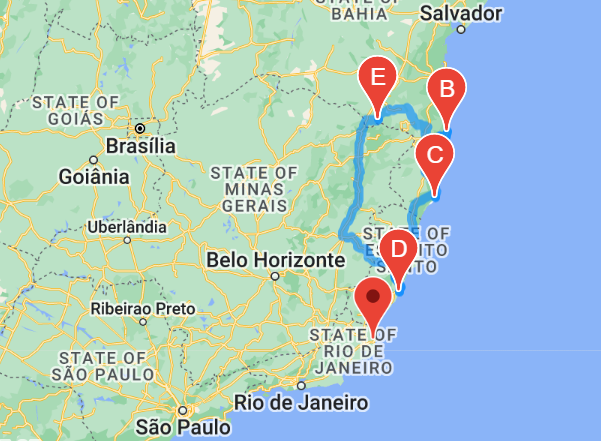

# World Weather Analysis

## Overview of Project
### Purpose of Project
In this project, I demonstrated my proficiency with OpenWeatherMap and Google Directions API requests to:

(1) Weather_Database Folder
Generate a set of 2,000 random latitudes and longitudes, retrieve the nearest city, and perform an API call with the OpenWeatherMap. Retrieve the current weather description for each city. Then, create a new DataFrame containing the updated weather data.

(2) Vacation_Search Folder 
Use input statements to retrieve customer weather preferences, then use those preferences to identify potential travel destinations and nearby hotels. Then, show those destinations on a marker layer map with pop-up markers.

(3) Vacation_Itinerary Folder
Use the Google Directions API to create a travel itinerary that shows the route between four cities chosen from the customer’s possible travel destinations. Then, create a marker layer map with a pop-up marker for each city on the itinerary. 

### Background of Project
MyTrip is a fictional travel technology company that specializes in internet related services in the hotel and lodging industry. Jack, the head of analysis for the user interface team, wants to collect and present data for customers via the search page, which they will filter based on their preferred travel criteria in order to find their ideal hotel anywhere.  Using Jupyter Notebook, I have performed requests on the OpenWeather API to retrieve the data and clean it. Then, from the list of potential travel destinations, the beta tester will choose four cities to create a travel itinerary. Finally, using the Google Maps Directions API, a travel route between the four cities as well as a marker layer map is created.

---
## Deliverables 
### Map with Pop-Up Markers
A map with pop-up markers for the cities in the vacation DataFrame is created. Each marker has the following information: 
* Hotel Name 
* City
* Country
* Current Weather Description
* Maximum Temperature 

### Travel Map
A driving directions layer map between four nearby cities.  

### Ininerary Map with Pop-Up Markers 
A marker layer map with a pop-up marker for the cities on the itinerary. 

